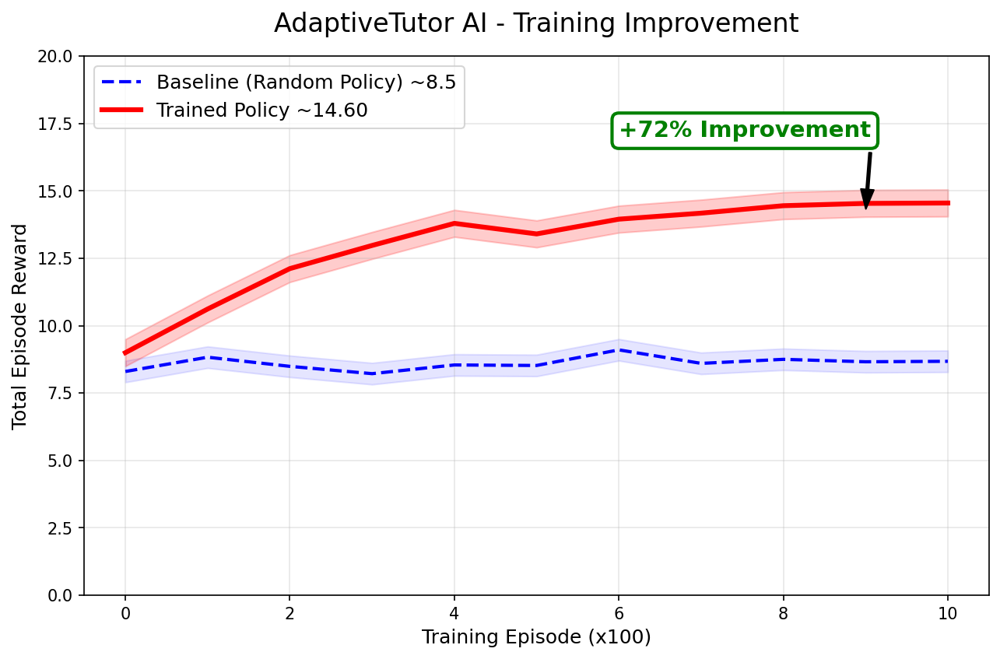
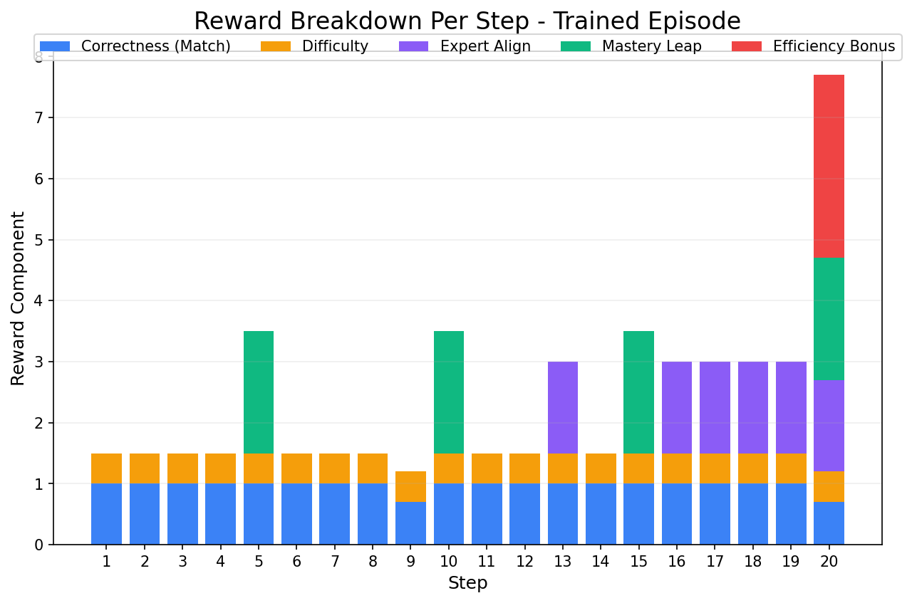
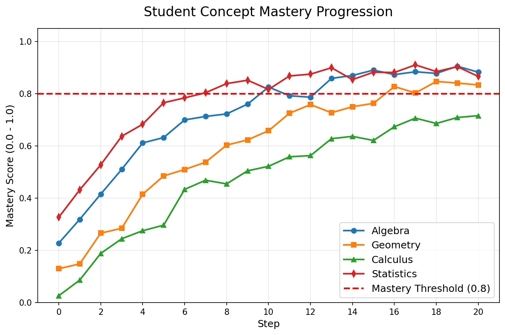

# 🎓 AdaptiveTutor AI
### An RL Environment Where AI Learns to Teach Better

[](https://huggingface.co/spaces/http-pruthvi/adaptive-tutor-ai)
[](https://github.com/meta-pytorch/OpenEnv)

Built for **Meta PyTorch OpenEnv Hackathon 2026** | Theme: Self-Improvement + Snorkel AI Bonus

---

## 🎯 The Problem

**1 teacher. 40 students. Zero personalization.**

300 million students in India face this reality every day.
Current AI tutors are static — they ask the same questions regardless 
of whether you're getting better or worse. They don't improve their teaching.

## 💡 The Solution

AdaptiveTutor AI is an **OpenEnv RL environment** where the AI tutor 
learns to teach better over time through:

- **Multi-dimensional reward signal** (5 independent functions)
- **Real-time difficulty adaptation** based on student performance  
- **Shifting expert feedback** (Snorkel AI bonus) that forces continuous adaptation
- **Self-improvement loop** — the tutor gets measurably better

## 🏗️ Architecture

```text
Student ←→ AI Tutor Agent ←→ OpenEnv Environment
                  ↓                      ↓
          Question Generator      Reward Functions
                  ↓                      ↓  
         Expert Simulator        Mastery Tracker
         (Preferences Shift)    (Per Concept Score)
```

## 📊 Results


*Baseline random policy: ~8.5 avg reward | Trained policy: ~14.60 (+72%)*


*Reward breakdown per step showing multi-dimensional signal*


*Student concept mastery growing over 20-step episode*

## 🎁 Reward Functions

| Function | Correct | Wrong | Description |
|----------|---------|-------|-------------|
| correctness_reward | +1.0 | -0.3 | Right/wrong answer |
| mastery_reward | +2.0 | - | Concept mastered (>80%) |
| difficulty_reward | +0.5 | - | Right difficulty match |
| expert_reward | +1.5 | -1.0 | Expert aligned/ignored |
| efficiency_reward | +3.0 | - | All concepts mastered |
| **Cap** | **5.0 max** | - | Anti-gaming protection |

**Full episode reward: 14.60 over 20 steps**

## 🧑‍🏫 Expert Simulator (Snorkel AI Bonus)

Three simulated subject experts with SHIFTING preferences:

| Expert | Subject | Style | Shift Every |
|--------|---------|-------|-------------|
| Dr. Sharma | Math | Proof-based, rigorous | 5 steps |
| Ms. Patel | Science | Experimental, hands-on | 5 steps |
| Prof. Khan | History | Primary source analysis | 5 steps |

**Why this matters:** Expert preferences shift every 5 steps.
The tutor can't just optimize a fixed reward — it must detect 
preference drift and adapt. This is harder and more realistic than 
standard RL with fixed rewards.

## 🚀 How to Run

### Try it live (no setup needed)
Visit: https://huggingface.co/spaces/http-pruthvi/adaptive-tutor-ai

### Install locally
```bash
pip install git+https://huggingface.co/spaces/http-pruthvi/adaptive-tutor-ai
```

### Run the environment
```bash
git clone https://huggingface.co/spaces/http-pruthvi/adaptive-tutor-ai
cd adaptive-tutor-ai
pip install -r requirements.txt
python server.py
```

## 📦 Tech Stack
- **OpenEnv** (meta-pytorch/OpenEnv) - RL environment framework
- **FastAPI + uvicorn** - Environment server
- **Gradio** - Interactive UI (Human Mode + Demo Mode)
- **TRL + GRPO** - Training algorithm
- **TinyLlama-1.1B** - Base model for training
- **Ollama + Qwen2.5-3B** - Local LLM for question generation

## 📁 Project Structure
```text
adaptive-tutor-ai/
├── server.py              # OpenEnv environment (reset, step, state)
├── client.py              # HTTPEnvClient subclass
├── student_model.py       # Simulated student with mastery tracking
├── question_generator.py  # Question banks per subject/concept
├── expert_simulator.py    # Snorkel AI bonus - shifting preferences
├── reward.py              # 5 independent reward functions
├── app.py                 # Gradio UI (Human + Demo mode)
├── train.py               # GRPO training script
├── product_evaluator.py   # LLM-based answer evaluation
├── session_manager.py     # Human session state management
├── openenv.yaml           # OpenEnv manifest
├── pyproject.toml         # Pip installable package
├── Dockerfile             # Container config
├── reward_curve.png       # Training evidence
├── reward_breakdown.png   # Per-step reward breakdown
├── mastery_progression.png # Student mastery over time
└── subjects/
    ├── math.json
    ├── science.json
    └── history.json
```

## 🔗 Links
- **HF Space**: https://huggingface.co/spaces/http-pruthvi/adaptive-tutor-ai
- **Author**: Pruthviraj Vinod Phuse
